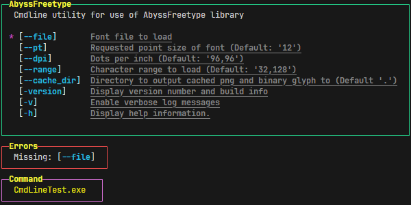

# README.md

## Features

* Options   - Strings
* Flags     - Booleans
* UTF8 console output.

## Using

Options are passed like so "--OPTION VALUE"

Flags are passed like so "-FLAG"

### Full command

```bash
MyExecutable -FLAG1 --OPTION1 VALUE1 --OPTION2 VALUE2 -FLAG2
```

## Example output


